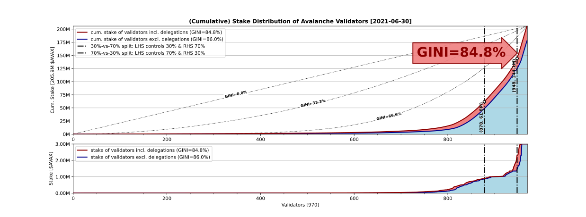

# Stake Distribution of Avalanche Validators



The graph above shows the *cumulative stake distribution* among the Avalanche validators: Since (at the moment), there is no progressive taxation on the larger validator *rewards*, the shown GINI inequality coefficient is applicable to wealth (i.e. stake) *and* income (i.e. rewards):

1. The *red* line plots the cumulative stake of validators including delegations. The shown GINI coefficient is applicable to this plot of total weights only.

2. The *blue* line plots the cumulative stake of validators excluding delegations, where its GINI coefficient is not shown, but it is obviously in the same ball park as for the *red* one.

3. The diagonal *dotted* line is the "frontier of decentralization", i.e. if all stakes were distributed equally among all the validators, then the *red* and *blue* lines would overlap with this *dotted* diagonal.

4. And finally, the vertical *dashed-dotted* one is the "line of control" at the `30%` -vs- `70%` split (w.r.t. total stakes): Hence, the *many* smaller validators on the *left hand side* of the line control only `30%` of all stakes, while the *few* larger validators on the *right hand side* control a whopping `70%`!


### GINI and Wealth

Despite having such an extreme wealth GINI, Avalanche suprisingly seems to feature *less wealth inequality* than the [global][gini-wealth] average of `88.5%` (in 2019) and about the *same* as for the [United States][gini-wealth] of `85.2%` (also in 2019). Although extreme, these two comparisons are perhaps an indication, that there should not be a *wealth tax* (i.e. partial confiscation and redistribution) on the existing larger validator stakes.

[gini-wealth]: https://en.wikipedia.org/wiki/List_of_countries_by_wealth_inequality

### GINI and Income

However, if we compare the same GINI in terms of *rewards* (on the stakes), then it is obvious that Avalanche displays __significantly__ *more income inequality* than the [global][gini-income] average of `38%` (in 2002) and also *more* than the [United States][gini-income] of `47%` (in 2014). This gap is a clear indication, that the Avalanche validator community should introduce *progressive taxation* on the larger validator *rewards* (but not stakes), and then redistribute the collected tax among the smaller ones.

[gini-income]: https://en.wikipedia.org/wiki/List_of_countries_by_income_equality


## Prerequisite(s)

```
Name        : python
Version     : 3
Description : Next generation of the python high-level scripting language
URL         : https://www.python.org/
```

```
Name            : jq
Version         : 1.6-4
Description     : Command-line JSON processor
URL             : https://stedolan.github.io/jq/
```

```
Name            : geoip
Version         : 1.6.12-2
Description     : Non-DNS IP-to-country resolver C library & utils
URL             : https://www.maxmind.com/app/c
```

## Installation

```sh
$ ./setup.sh ## setup virtual python environment
```

```sh
$ source bin/activate ## activate virtual python environment
```

```sh
[avalanche] $ ./setup.py install ## setup python dependencies
```

## Fetch Stake Distribution

```sh
$ ./stakes.sh -h
```
```
Usage: stakes.sh
    [-a|--api-host=${API_HOST-https://api.avax.network}]*
    [-h|--help]
```

```sh
$ ./stakes.sh ## fetches stake distribution
```

## Plot Stake Distribution

```sh
[avalanche] $ ./stakes.py -h
```
```
Usage: stakes.py
    [-h] [--seed SEED] [--gini-00] [--gini-33] [--gini-66] [-s]
    [-x EXPONENT] [data_path]

Plots Avalanche stake distribution

positional arguments:
  data_path             path to validator data (default: None)

optional arguments:
  -h, --help            show this help message and exit
  --seed SEED           random generator seed (default: 1)
  --gini-00             plot equal distribution (default: False)
  --gini-33             plot uniform distribution (default: False)
  --gini-66             plot log-logistic distribution (default: False)
  -g, --group           group by reward address (default: False)
  -e, --extended        use extended validators (default: False)
  -x EXPONENT, --exponent EXPONENT
                        distribution exponent mapper (default: 1.0)
  -s, --show            show plot (default: False)
```

```sh
[avalanche] $ ./stakes.py  ## plots stake distribution
```

## List Stake Distribution

```sh
$ ./json/validators-list.sh -h
```
```
Usage: validators-list.sh
    [-m|--min-n=${MIN_N-0}] [-M|--max-n=${MAX_N}]
    [-g|--group-by-address] [-h|--help]
```

```sh
$ ./json/validators-list.sh -g < ./json/$(date +'%Y-%m-%d')/validators-ext.json
```

## Copyright

 © 2021, [Hasan Karahan](mailto:avalanche@blackhan.com), MSc ETH Zurich.
